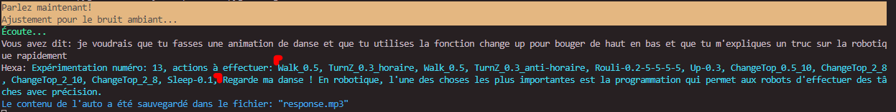
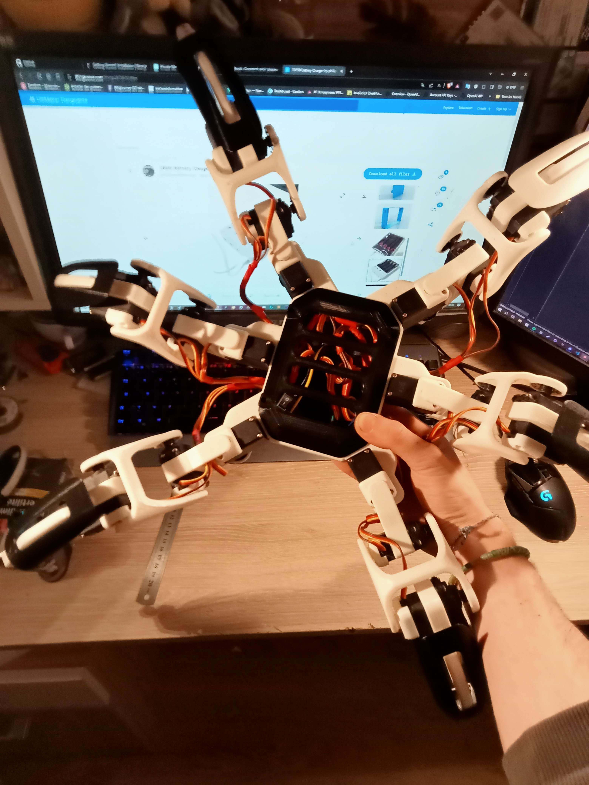
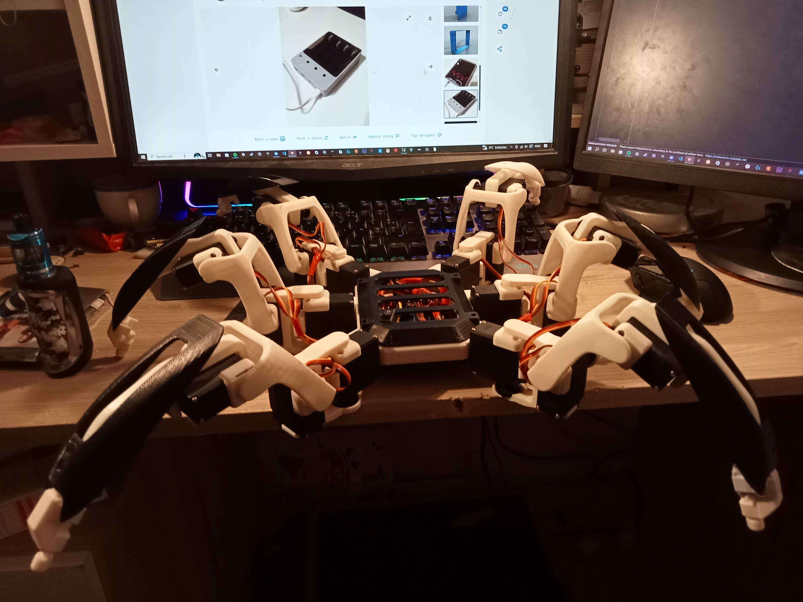

# Aash

**/!\ pour information ce projet est en constante évolution, quasiment tout les jours le repos change ( [surtout ici](./software/IA/) )** : *01/01/2025*

*Aash est un robot open source en phase de développement. Son objectif est d'aider dans l'initiation à la robotique. Il sera équipé d'un système d'intelligence artificielle pour la communication, la gestion des animations par cinématique inversée, la vision par ordinateur, et la navigation autonome.*

### En cours de développement
- **Intelligence Artificielle**:
    - `Langage Naturel`: bientôt fini à 100%,
    - `Gestion de l'algorithme de cinématique inversée`: *animations en fonction des prompts*; bientôt fini à 100%
    - `NPU`: Mise en place d'un NPU rk3588s à l'aide d'un Orange Pi 5 Pro, pour avoir de meilleurs performances niveau IA [RKLLAMA](https://github.com/notpunchnox/rkllama).
    - `Computer Vision`: Segmentation, Image Classification, Image extraction ( Terminé )**[13 octobre 2024]**

Avant le programme NLP utilisait l'API `Gemini` et `Google TTS`.

Maintenant le robot fonctionne à l'aide de `Aash:3b` un modèle basé sur `Qwen2.5:3b`, il contient 3 Milliards de paramètres, il est très bien optimisé et idéal pour les ordinateurs avec peu de performances.

Le modèle à été entrainé avec des `Datasets` faites à partir des anciennes intéractions avec Gemini, le programme permettant de lancer le `LLM` met en place une technologie nommé [RAG](./software/IA/LLM-RAG/) et permet de rajouter des connaissances au modèle LLM de façon optimisé en créant `une base de donnée vectorielle`, vous pouvez modéliser les connaissances de l'IA en lui mettant des fichiers de documentation `Markdown|JSON|TXT` dans ce répèrtoire: [Training Data](./software/IA/LLM-RAG/src/Training%20Data/)

- **Animations ( `Walk`, `Up`, `Sleep`, `ChangeTop`, `InverseKinematic`: `rouli`... )**: J'ai ajouté des matrices permettant de contrôller chaque pattes indépendament des autres, et un mouvement progressif entre chaque positions permettant de fluidifier les séquences d'animations avec de belles transitions.
**[6 octobre 2024]** Des animations en boucles ont été mises en place avec une amélioration de la marche et des rotations.

**Exemple**: Custom; Attack; StartWalk_2_avant_arrière_gauche_droite; StopWalk, StartTurn_speed_sens_extansion-de-la-patte; StopTurn.

**Exemple de conversation avec l'IA:**

**Exemple de cinématique inversée:** *En cours de développement*

    
    

    
    

- Composition du robot: [Composants du robot](https://github.com/NotPunchnox/hexa/blob/main/hardware/Composants.md)
- Images du robot en 3D (autodesk Fusion360): [Images en 3D](https://github.com/NotPunchnox/hexa/blob/main/hardware/Aash%203d.md)
- Guide pour mettre en place le `Raspberrypi zero w` et la `camera` [Guide Camera](./learn/Setup%20Camera/README.md)

## Fonctionnalités

- Conception économique et polyvalente
- Système d'intelligence artificielle pour la communication, l'adaptabilité, la vision et la navigation autonome.
- Intégration d'une IA [Go to IA](https://github.com/NotPunchnox/hexa/blob/main/software/IA/)

## Contenu du dépôt

- **Documentation** : Contient la documentation du projet. => [Documentation](./Documentation/README.md)
- **Cours**: Explications sur les mathématiques utilisés dans le robot, tel que la cinématique inversée, programmation etc => [Cinématique inverse](./learn/README.md)
- **Hardware** : Contient l'assemblage, les composants, le câblage, etc. => [Documentation matérielle](./hardware/Composants.md)
- **Software** : 
    - **Frimware**: Contient Le code source du frimware à flasher [Frimware esp8266](./software/Arduino/)
    - **IA**: Comprend le code source des programmes basés sur l'IA ( LLM, RAG, Embedding, TTS/STT, Vision, Serial-controller ).
        - [Version Communication orale: Python](./software/IA/speaker/readme.md) */!\ Archived*
        - [LLM RAG](./software/IA/LLM-RAG/)
        - [Vision](./software/IA/vision/)
    - **Simulateur**: Contient un simulateur pour le robot Aash. [Simulateur](./software/simulator/README.md)
- Issues : Section pour signaler des bugs ou suggérer des améliorations.

## Licence

Ce projet est sous licence [Creative Commons Attribution-NonCommercial-ShareAlike 4.0 International (CC BY-NC-SA 4.0)](https://creativecommons.org/licenses/by-nc-sa/4.0/deed.fr). Vous êtes autorisé à utiliser, partager, modifier et distribuer le projet à des fins non commerciales, en mentionnant l'auteur d'origine et en partageant toute modification sous la même licence.

## Collaborateurs

[Trotiflex](https://github.com/trotiflex) est une collaboratrice clé qui a apportée une contribution significative au projet. Principalement axé sur la cinématique inversée, Trotiflex a joué un rôle essentiel dans l'écriture de cours détaillés sur ce sujet. [Cours](./learn/maths/cinématique_inversée.md).
