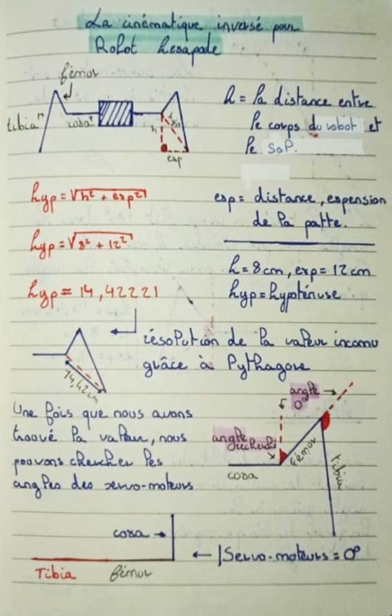
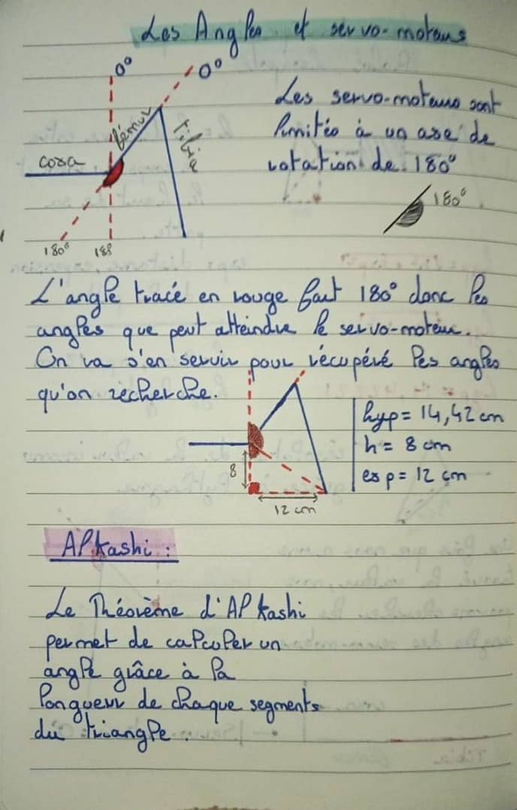
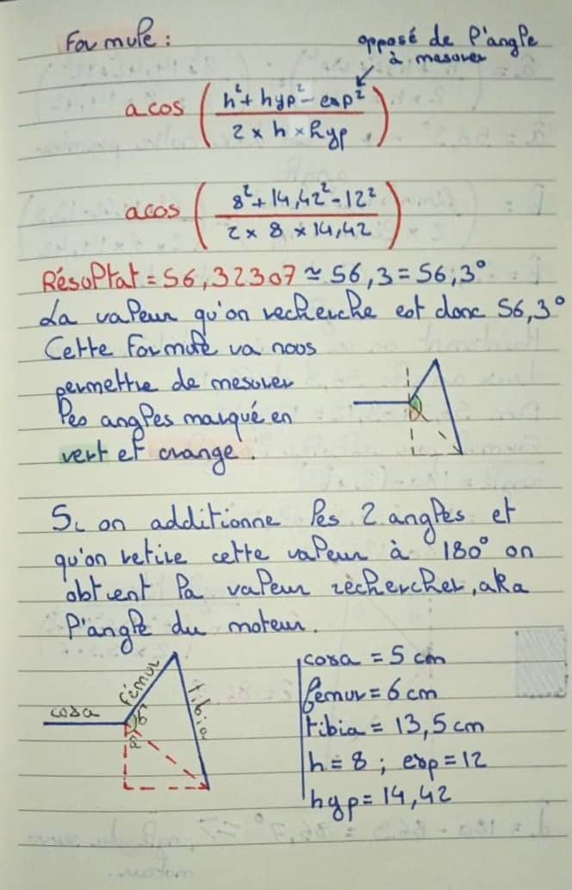
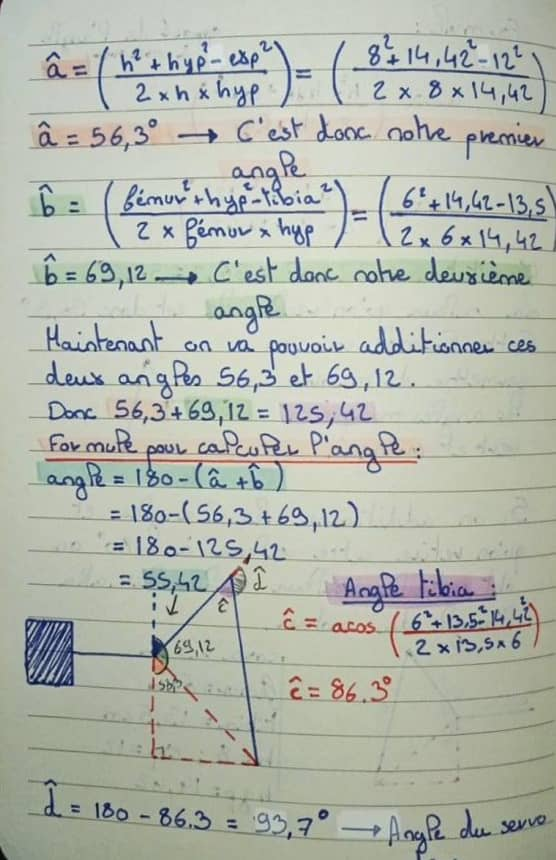

# Bases de la cinématique inversée

Les cours ci dessous ont été écrit par [Trotiflex](https://github.com/trotiflex), merci de sa collaboration.

### La cinématique inversée c'est quoi ?
*La cinématique inversée d'un robot hexapode se réfère à la détermination des angles des articulations des pattes du robot en fonction d'une position souhaitée du bout de la patte. En d'autres termes, plutôt que de calculer comment le robot se déplace en fonction des angles des articulations (cinématique directe), la cinématique inverse résout le problème inverse : elle détermine les angles nécessaires pour atteindre une certaine position.*

