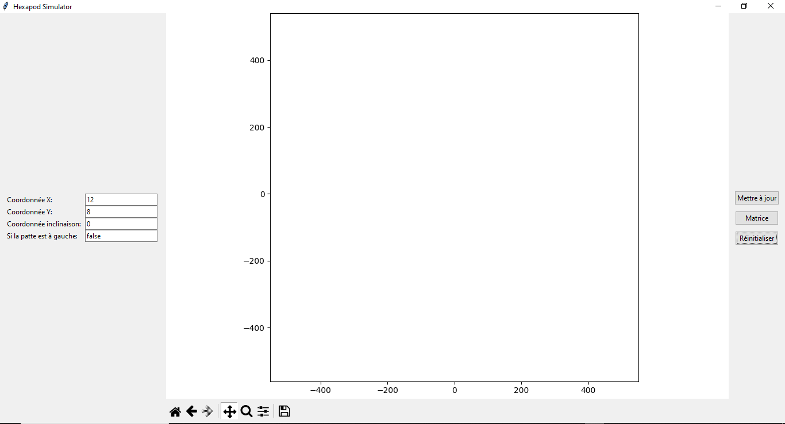
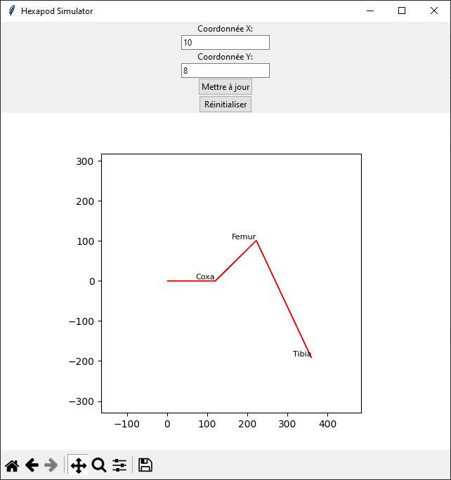
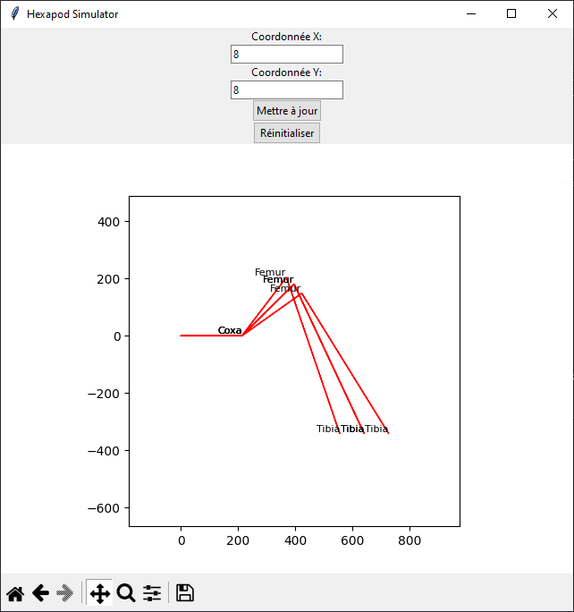

# Simulateur 2D pour Hexa

### Description
*Cet application est le début d'un simulateur pour robot hexapod dont `Hexa` pour le moment, il a été codé en python et utilise l'algorithme golang ( `algorithme.go` ) pour le moment*

*Il permet de visualiser les mouvements exercés par les servomoteurs sur la patte du robot grace à la cinématique inversée*

*Cela vous permet de créer vos animations juste en donnant une position `x` et `y`*

### Visuel

### Installation

