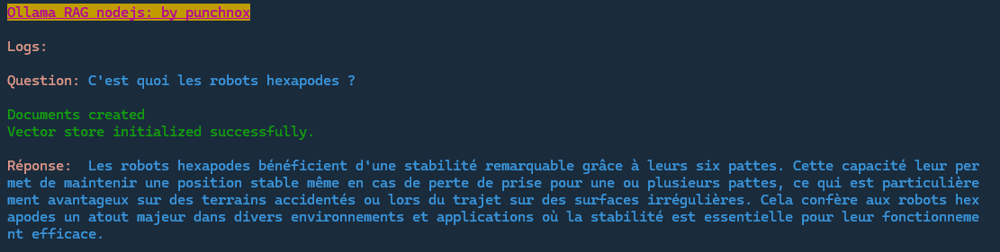
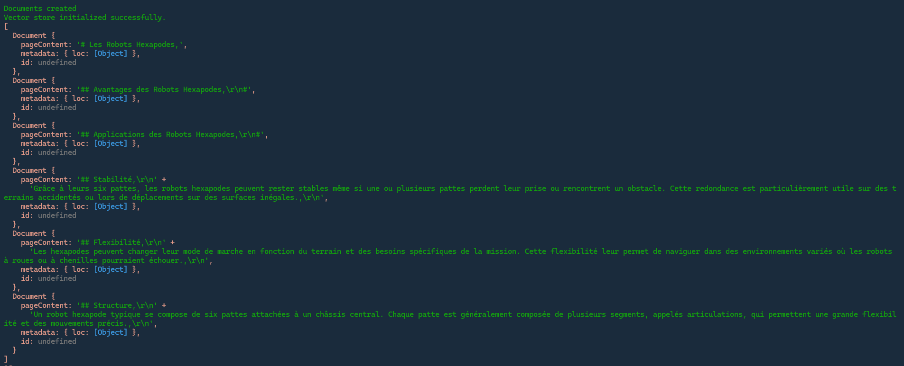

# RAG Ollama langchain js
Original repository: https://github.com/notpunchnox/RAG-Ollama


## Description

Ce logiciel est l'IA de Aash il fonctionne avec du RAG (Retrieval-Augmented Generation), Il permet de communiquer avec le robot de façon écrite ou à l'oral, vous pouvez donner les connaissances de vôtre choix au robot en ajoutant simplement des fichiers ( Markdown, txt, JSON )

## Fonctionnalités

- **Retrieval-Augmented Generation (RAG)** : Combine la récupération d'informations et la génération de texte pour fournir des réponses contextuellement pertinentes.
- **Intégration avec Ollama** : Utilise Ollama pour communiquer avec les modèles d'IA.
- **Extensibilité** : Permet d'ajouter des fichiers pour enrichir les connaissances de l'IA.
- **Configuration Flexible** : Peut être adapté pour divers cas d'utilisation en fonction des besoins spécifiques.
- **Utilisation du modèle `mathstral`**: Modèle `7B` le plus performant en terme de raisonnement mathématique et logique.




## Prérequis

Avant de commencer, assurez-vous que vous avez installé les outils suivants :

- [Node.js](https://nodejs.org/) ( Framwork JavaScript )
- [Ollama](https://ollama.com/) serveur en fonctionnement

## Installation

1. **Clonez le dépôt**

   ```bash
   git clone https://github.com/notpunchnox/Aash
   cd ./Aash/software/IA/LLM-RAG
   ```

2. **Installez les dépendances**

   ```bash
   npm install
   ```

3. **Configurez Ollama**
   Assurez-vous que le serveur Ollama est en cours d'exécution à l'URL spécifiée dans le code ( `http://localhost:11434` ). Vous pouvez ajuster cette URL dans le fichier de configuration si nécessaire.

4. **Veuillez installer les modèles**
   
   *Modèle d'embedding:*
   ```bash
   ollama pull nomic-embed-text
   ```

   *Modèle LLM ( Large Language Model ):*
   ```bash
   ollama pull mathstral
   ```

5. **Configuration ( falcutatif )**
   
   Si vous désirez utiliser d'autres modèles vous pouvez changer la configuration du logiciel dans [Config.json](./config.json)
   ```js
   {
      "OLLAMA_API_URL": "http://localhost:11434",// Url de vôtre API Ollama
      "EMBEDDING_MODEL": "nomic-embed-text",// Modèle d'embedding
      "LLM_MODEL": "gemma:2b"// Modèle LLM
      "stream": true,// Afficher le texte s'écrire petit à petit
      "format": "json",// Force une réponse au format JSON
      "tts": true// Lis la réponse à l'oral ( text to speech )
   }
   ```

## Utilisation
   **Client ( CLI )**:
   Vous pouvez utiliser le client cli pour poser des questions plus facilement à l'IA, pour se faire utilisez la commande suivante:
   ```bash
      npm run client
   ```


1. **Initialisation de l'embedding**

   Utilisez la fonction `InitEmbedding()` pour charger les fichiers dans `Training Data` pour les compresser, les transformer en documents puis les transformer en suites vectorielles pour les sauvegarder: `InitEmbedding.js`.

   ```js
   import InitLogic from "./src/controller/InitEmbedding.js";
   const vectorStore = await InitEmbedding();
   ```

2. **Poser des Questions**

   Utilisez le fichier `Question.js` pour poser des questions au modèle et obtenir des réponses basées sur les documents indexés.

   ```js
   import Question from "./src/router/Question.js";

   const prompt = 'Quels sont les avantages des robots hexapodes ?';
   Question(prompt, 5, 'gemma:2b');//Tout les paramètres

   Question(prompt);//Les paramètres par défaut seront 3 et le modèle choisis dans le config.json
   ```

   Ici, `prompt` est la question que vous souhaitez poser, et `5` est le nombre maximum de résultats à renvoyer.

## Ajouter des Fichiers

Pour rendre l'IA plus intelligente ou l'adapter à des contextes spécifiques :

1. **Placez vos fichiers** dans le dossier [./src/Training Data](./src/Training%20Data).

2. **Formatez les documents** en Markdown ou tout autre format texte que vous souhaitez ajouter.

   *Les fichiers ajoutés ne sont pas pris en compte automatiquement pour le moment, mais ce sera bientôt fait.*

## Structure du Projet
- `index.js` : Fichier principal contenant le code.
- `src/`
  - `controller/`
    - `InitLogic.js`
    - `InitEmbedding.js` : Initialise l'embedding et met en mémoire les suites vectiorielles.
    - `Embedding.js` : Comporte la fonction Search permettant de trouver des élements pertinent dans la base de donnée vectiorielle.
  - `router/`
    - `Question.js` : Gère les requêtes de questions et les réponses du modèle.
  - `correctif/`
    - `embeddingOllama.js` : Correctif s'appliquant sur le package `langchain` si le programme ne fonctionne pas ( ajoutant aussi un debugger pour trouver l'erreur )
  - `Training Data/` : Contient les fichiers utilisés pour servir de contexte au modèle.

## Licence

Ce projet est sous [MIT License](LICENSE).

Développeur: [punchnox](https://github.com/notpunchnox)